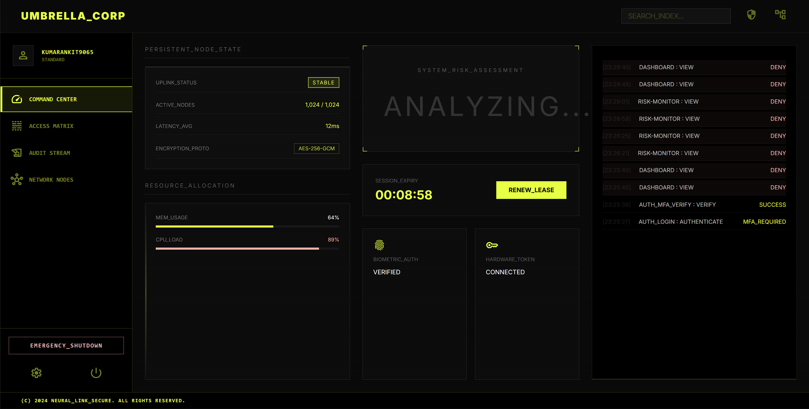
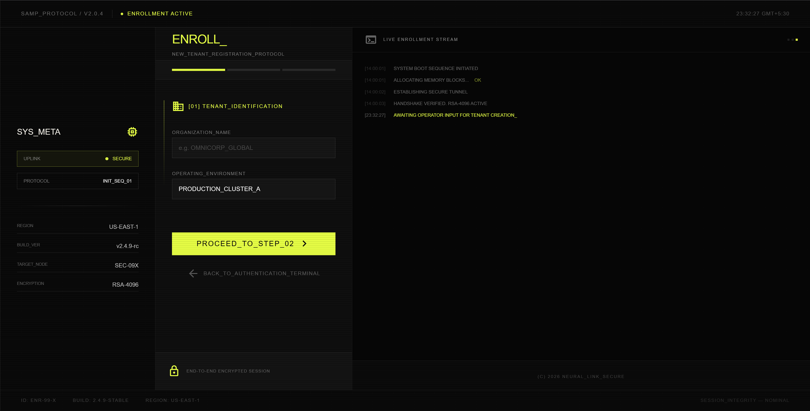
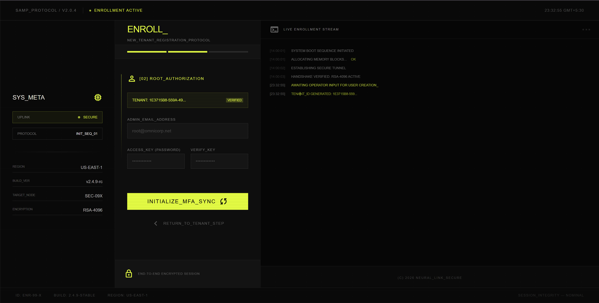
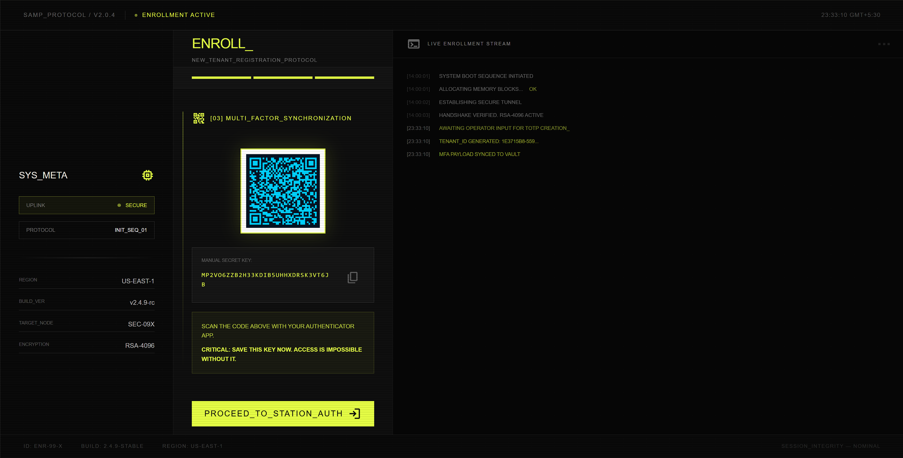
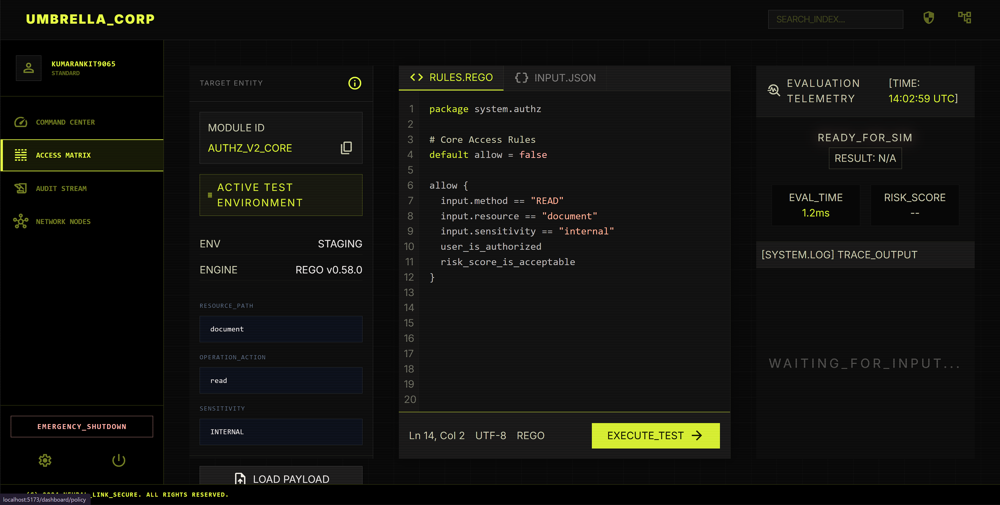

# SAMP (Secure Access Management Platform)

<div align="center">
  
</div>

<br/>

SAMP is a modern, enterprise-grade authentication and authorization platform designed with a multi-tenant, microservices architecture. It provides a secure, centralized identity layer equipped with Multi-Factor Authentication (MFA), real-time risk evaluation, and comprehensive audit logging.

## 📸 Interface Showcases

### Registration Protocol

<table align="center">
  <tr>
    <td align="center" width="33%">
      
      <br/><em>[01] Tenant Identification</em>
    </td>
    <td align="center" width="33%">
      
      <br/><em>[02] Root Authorization</em>
    </td>
    <td align="center" width="33%">
      
      <br/><em>[03] MFA Synchronization</em>
    </td>
  </tr>
</table>

### Access Control & Policy Evaluation

<div align="center">
  
</div>

<br/>

## 🚀 Architecture

The platform operates using a decoupled, dual-service architecture to ensure horizontal scalability and performance isolation:

- **Frontend Application (`/frontend`)**: A high-performance, cyberpunk-themed React application built with Vite, Tailwind CSS, Zustand, and Three.js/React-Globe.gl for real-time 3D data visualization.
- **Authentication Service (`/auth-service`)**: A robust Spring Boot 3.x backend running on Java 17. Handles tenant registration, JWT lifecycle management, TOTP verification, and RBAC/ABAC policy enforcement.
- **Risk Engine (`/risk-engine`)**: A high-throughput Python 3.11 service built with FastAPI. Evaluates session telemetry in real-time to compute threat matrices and trigger step-up authentication.

## 🛠 Tech Stack

- **Frontend**: React 18, Vite, TypeScript, TailwindCSS v4, Zustand, Framer Motion, Three.js
- **Backend (Auth)**: Java 17, Spring Boot 3, Spring Security, Hibernate
- **Backend (Risk)**: Python 3.11, FastAPI, Pydantic
- **Infrastructure**: PostgreSQL, Redis, Docker Compose
- **Security**: JWT (RSA-256), TOTP (RFC 6238), Bcrypt

## ⚙️ Quick Start

### 1. Start Infrastructure Dependencies
Ensure Docker Desktop is running. Start the required PostgreSQL and Redis instances:
```bash
docker compose up -d
```

### 2. Launch Auth Service (Java)
```bash
cd auth-service
mvn spring-boot:run
```

### 3. Launch Risk Engine (Python)
```bash
cd risk-engine
python -m venv .venv
.venv\Scripts\activate  # Windows
# source .venv/bin/activate # macOS/Linux
pip install -r requirements.txt
python main.py
```

### 4. Launch Frontend (React)
```bash
cd frontend
npm install
npm run dev
```
Navigate to `http://localhost:5173` to access the registration and command center interface.

## 🔐 Key Features

- **Multi-Tenant Isolation**: Built-in support for B2B structures. Every token, policy, and user is rigidly bound to a specific tenant ID.
- **Continuous Risk Assessment**: The Python risk engine continuously evaluates velocity ratios, IP reputation, and geo-mismatch to dynamically enforce security policies.
- **Hardware-Agnostic MFA**: Full TOTP provisioning flow and verification via mobile authenticator apps.
- **Real-Time Auditing**: Interactive dashboard with a global threat matrix visualization, mapping anomalies and real-time security events.

## 📜 License
Copyright © 2026 SAMP Protocol. All rights reserved.
